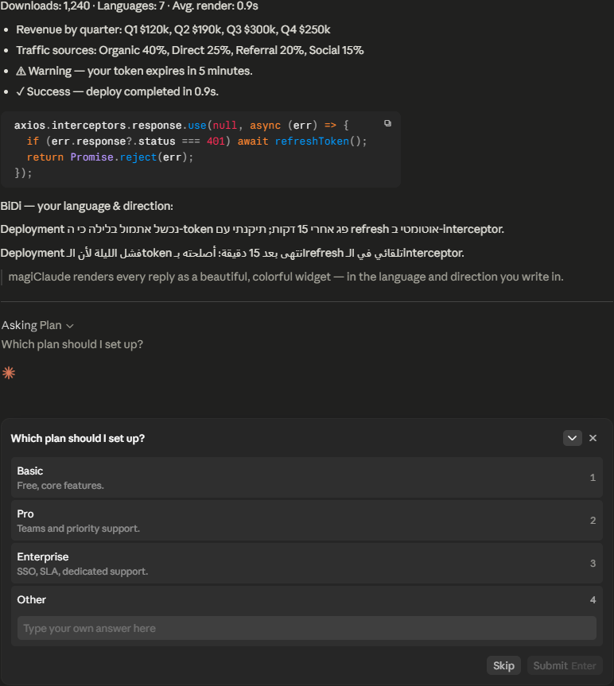
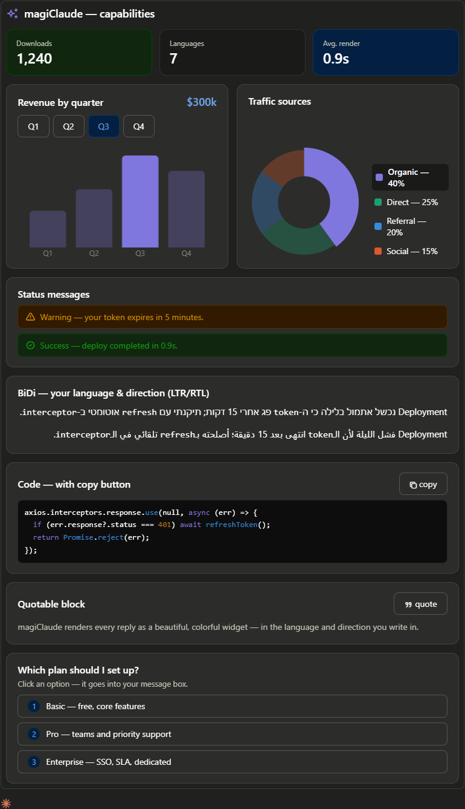

# ✨ magiClaude

magiClaude makes Claude's answers easier and more fun to read: beautiful, colorful, code highlight, charts ,dynamic buttons (quote, copy, choose), correct BiDi (RTL/LTR).

It doesn't modify Claude's core, only hook.

| Without magiClaude | With magiClaude |
|:------------------:|:---------------:|
|  |  |

## Install · Update · Uninstall

Copy & paste into Claude Desktop:

```text
Install YitshakS/magiClaude marketplace plugin
```

```text
Update YitshakS/magiClaude marketplace plugin
```

```text
Uninstall YitshakS/magiClaude marketplace plugin
```

## Try it

- `/magiClaude:demo` — capabilities demo
- `/magiClaude:banner-1`, `/magiClaude:banner-2` — animated banners

## ⭐ Like it?

If magiClaude makes your chats nicer, a star means a lot →
https://github.com/YitshakS/magiClaude

## License

MIT.
